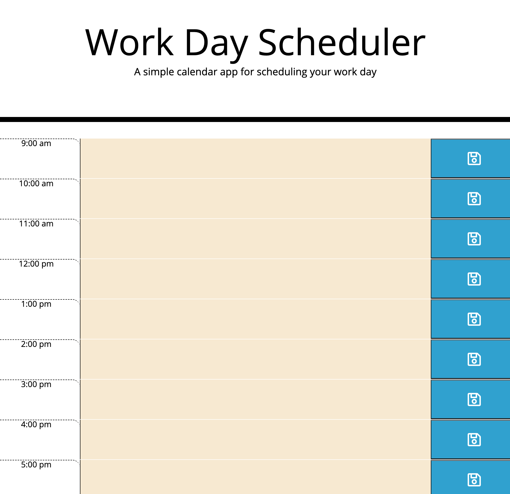

# Work Day Scheduler: Third-Party APIs.

This is a simple calendar application that allows the user to save events in their local storage for each hour of the working day.  This app will run in the browser and feature dynamically updated HTML, CSS and powered by the one and only jQuery.

This application also uses the (https://momentjs.com/) library to work with real date and time!

This scheduler will automatically color-code when an event has passed, the event will occur in the future, or it is a current scheduled event. 

# Logic 

Once the user has opened the day scheduler (see link below), the user can add important events in the text area next to each allotted hourly time slot.  Once the user has finished typing in their desired event, press the save icon to the right of the textarea to save this event.  The event will be saved in the local storage and stay on the scheduler until the local storage has been cleared.  The scheduler will also interact with the user by color coding events that have passed, are currently happening, or in the future.  Enjoy!

## User Story

```
AS AN employee with a busy schedule
I WANT to add important events to a daily planner
SO THAT I can manage my time effectively
```



